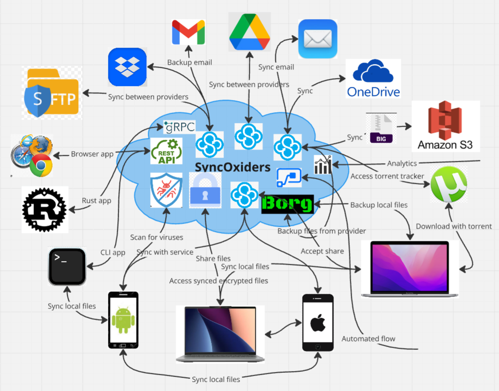

<link rel="shortcut icon" type="image/png" href="{{ "/favicon.png" | prepend: site.baseurl }}" >

Passionate about `Rust`, some of my projects:

) [SyncOxiders](https://syncoxide.rs)

Cloud file and email Sync, file Sharing, Backup and Encryption solution written in Rust.

The purpose of this project is to offer an easy and reliable way to sync files and emails between multiple providers and share files between multiple storage providers (like Google Drive, Dropbox, S3, SFTP servers, ...) and local files. Also simple way for backup of your files and emails and encryption. It offers real time sync (from simple Copy One-way to Two-way Sync) all handled in the cloud, without the explicit need of local clients.

) [rencfs](https://github.com/radumarias/rencfs)

An encrypted file system that is mounted with `FUSE` on Linux. It can be used to create encrypted directories.  
You can then safely backup the encrypted folder on an untrusted server without worrying about the data being exposed. You can also store it in any cloud storage like Google Drive, Dropbox, etc. and have it synced across multiple devices.

You can use it as CLI or build your custom FUSE implementation with it.

[rencfs-desktop](https://github.com/radumarias/rencfs-desktop)

GUI for `rencfs`

Currently is working only on Linux, with plans to support macOS and Windows, Android and iOS in the future.

It uses:
`egui` with `eframe` for GUI
`tokio` for concurrency
`tonic` for `gRPC` communication between GUI and daemon
`diesel` with `Sqlite` for `ORM`

[rencfs-daemon](https://github.com/radumarias/rencfs-daemon)

An encrypted file system in Rust that is mounted with `FUSE` on Linux. It can be used to create encrypted directories.  
It uses rencfs and can be installed as a systemd service and configured via YAML files.  
You can define encrypted directories with their mount points, defined as vaults. It exposes a gRPC server to interract with, you can build your own custom GUI client over it.

[rencrypt-python](https://github.com/radumarias/rencrypt-python)

A Python encryption library implemented in Rust. It supports AEAD with varius ciphers. It uses ring, RustCrypto (and derivates), sodiumoxide and orion to handle encryption.  
If offers slightly higher speed compared to other Python libs, especially for small chunks of data (especially the Ring provider with AES-GCM ciphers). The API also tries to be easy to use but it's more optimized for speed than usability.  
So if you want to use a vast variaety of ciphers and/or achieve the highest possible encryption speed, consider giving it a try.

[zeroize-python](https://github.com/radumarias/zeroize-python)

Securely clear secrets from memory. Built on stable Rust primitives which guarantee memory is zeroed using an operation will not be 'optimized away' by the compiler.  
It uses zeroize crate under the hood to zeroize and memsec for mlock() and munlock(). Maximum you can mlock is 2662 KB.  
It can work with bytearray and numpy array.

[gdrive-rs](https://github.com/radumarias/gdrive-rs)

A GDrive client in Rust using fuse3.

[rust-fuse3-template](https://github.com/radumarias/rust-fuse3-template)

A template for a Rust project using `fuse3`.  
It has a basic implementation of a filesystem with a single file with basic methods for a fs and the wrapper FUSE implementation.

[aws-lambda-axum-dynamodb](https://github.com/radumarias/aws-lambda-axum-dynamodb)

Simple aws lambda with axum, DynamoDB, API Gateway and CloudWatch

[in-mem-fs](https://github.com/radumarias/in-mem-fs)

A very basic implementation of an in-mem filesystem in Rust exposed with FUSE on Linux.  
It uses fuser crate to expose the system with FUSE.

[python-crypto-benchmark](https://github.com/radumarias/python-crypto-benchmark)

A basic benchmark of multiple Python crypto libs

[action-check-version-changed-rust](https://github.com/radumarias/action-check-version-changed-rust)

Checks if the version in Cargo.toml has changed since last time the job runned for a Rust project  
Useful in cases when you you want to automatically perform additional steps like creating a release and deploying/publishing the app if version is changed.  
Not useful when you create releases manualy and trigger deploy/publish from the release or manually.  
When the step runs, at the end, it saves in the cache the last commit in repo as since_commit and the next time it runs it checks for version change since that commit.
